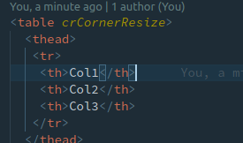
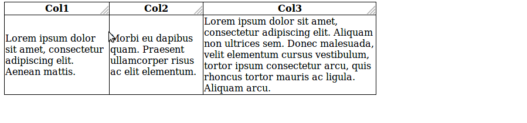
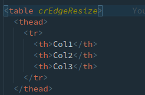
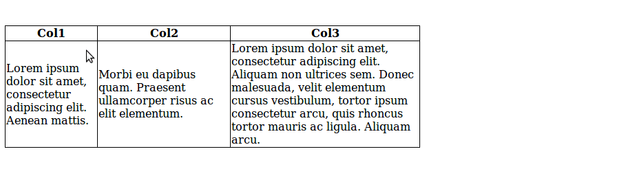
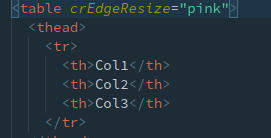
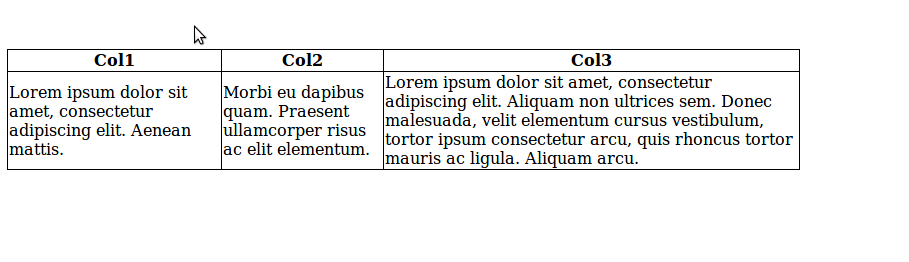

# Table Column Resize

This project was generated with [Angular CLI](https://github.com/angular/angular-cli) version 8.0.3.

## Features

Access to two Directives: CornerResizeDirective and EdgeResizeDirective. Use anyone to be able to resize of any html table

## Usage

First import the library module into your main app.module file: `import { ColresizeModule } from 'colresize';`

Add the `crCornerResize` directive to your table element for CornerResizeDirective (only use crCornerResize to elements with innerHTML of plain text):

Add the `crEdgeResize` directive to your table element for EdgeResizeDirective:

EdgeResizeDirective can also be given a highlight color input using the `crEdgeResize='pink'` syntax:

## Build

- Clone the project
- Use `npm install` to install all dependencies
- Build the colresize library using `ng build colresize` from the root of the project
- Use `ng serve` to launch the test app

## Install

Run `npm install --save colresize`
